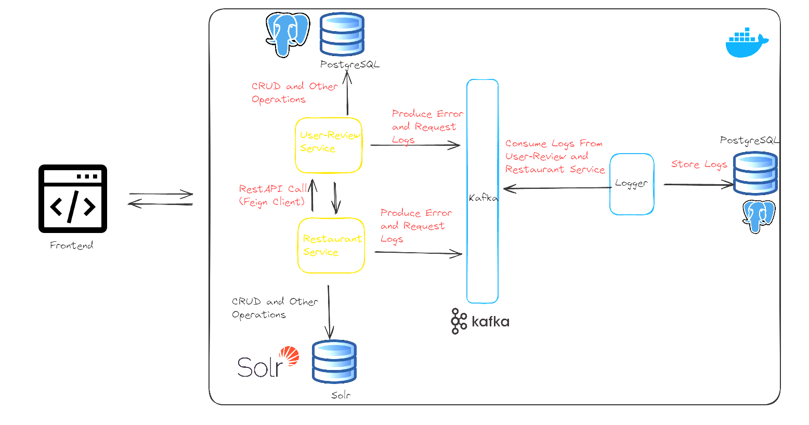
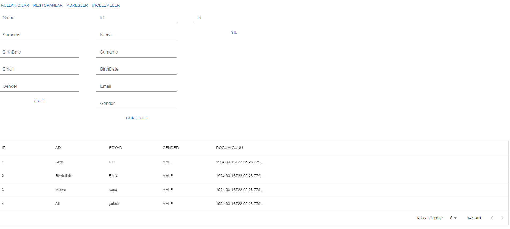
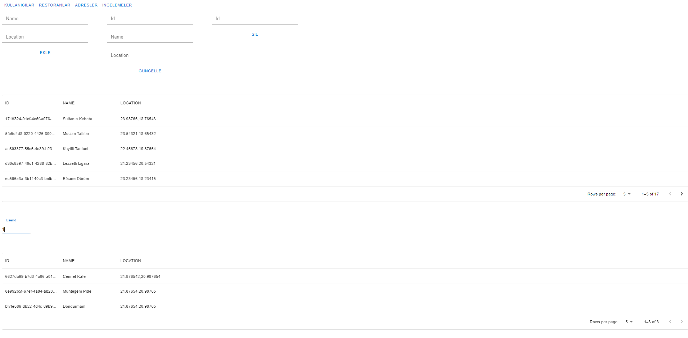
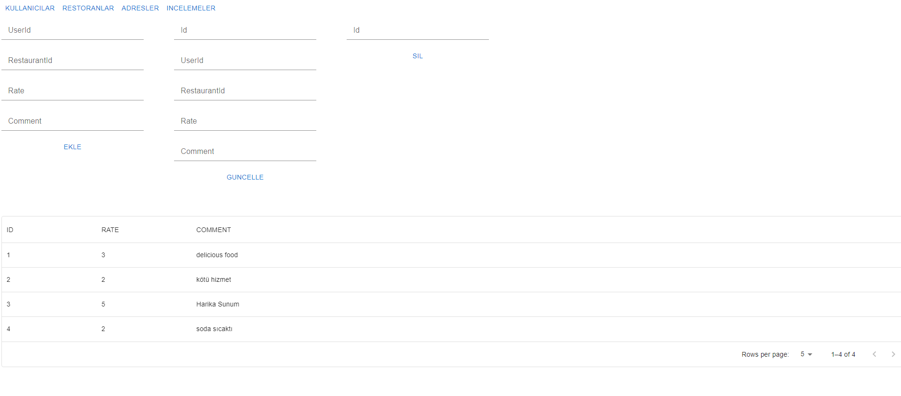
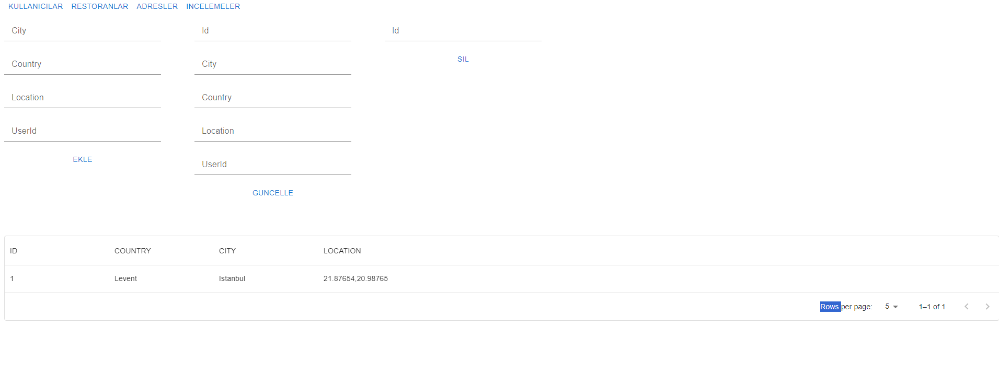
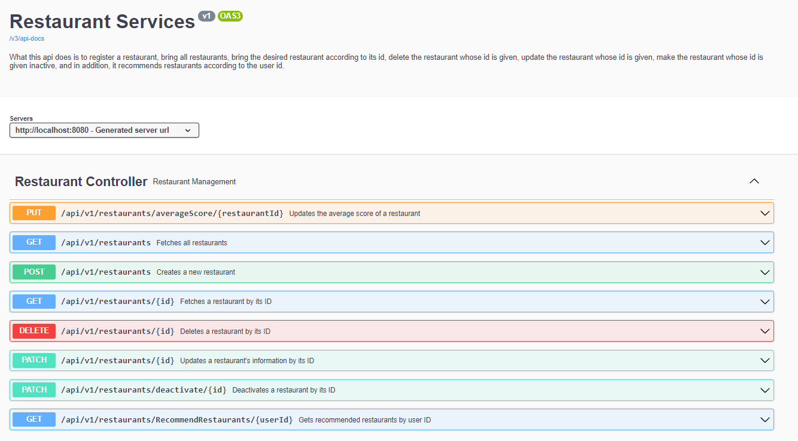
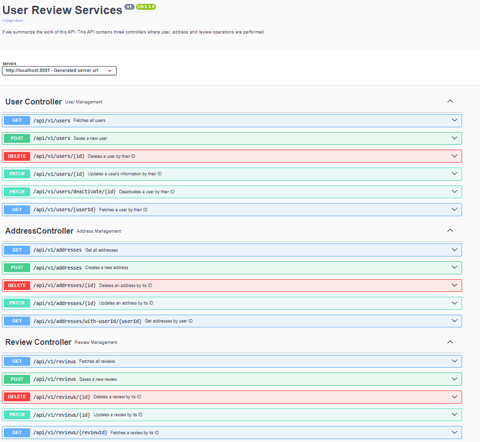
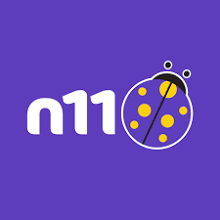

<!-- ABOUT THE PROJECT -->

## n11 TalentHub Backend Bootcamp Bitirme Projesi

### Process Chart of All Services

### About Project

The subject of this project is Java and Spring Boot. It includes user comments about users and restaurants, restaurant descriptions, and users' locations. It is a project in which 3 restaurant suggestions are presented, taking into account the restaurant and its score. There are three services in the project, the user-review service and the restaurant service exchange information with each other through the feign client. The user service performs database operations with PostgreSql. Restaurant service performs database operations with Solr. Error and Request logs of services are recorded in PostgreSql via Kafka.

## Overview
The Restaurant Review Service is a web application that enables users to review restaurants and receive personalized suggestions based on their location and restaurant preferences.

## Features
1. User Registration:
   - Users can register by providing their name, surname, latitude, longitude, and other necessary information.
   - Users can be registered, deleted, and their information can be updated.

2. Restaurant Registration:
   - Restaurants can be registered by providing necessary information including latitude and longitude.
   - Restaurant data is stored in Apache Solr.

3. Commenting System:
   - Users can leave comments on restaurants with scores ranging from 1 to 5.
   - Comments can be saved, deleted, and updated.

4. Personalized Suggestions API:
   - An API provides users with restaurant suggestions based on their location and restaurant preferences.
   - Suggestions consider the score of the restaurant and its proximity to the user's location.
   - The weight of the restaurant score is 70%, and the weight of proximity score is 30%.

5. Testing:
   - Unit and integration tests are provided to ensure functionality and reliability.
   - All APIs are tested to meet expected behavior.

## Technologies Used
- Java
- Docker
- Postgresql
- Kafka
- Spring Framework (Spring Boot, Spring Data)
- Hibernate
- Apache Solr
- RESTful API
- Swagger for API documentation
- Logging mechanism implemented
- Exception handling design pattern utilized
- JUnit and integration tests were written

###  Application

User Menu

Restaurant Menu

Address Menu

Review Menu

### Swagger Page of Application

<!-- LICENSE -->
## License

Distributed under the MIT License. See `LICENSE.txt` for more information.

<!-- CONTACT -->

## Contact

### Beytullah Bilek

  

 

## Java & Spring Boot | n11 TalentHub Backend Bootcamp

  

